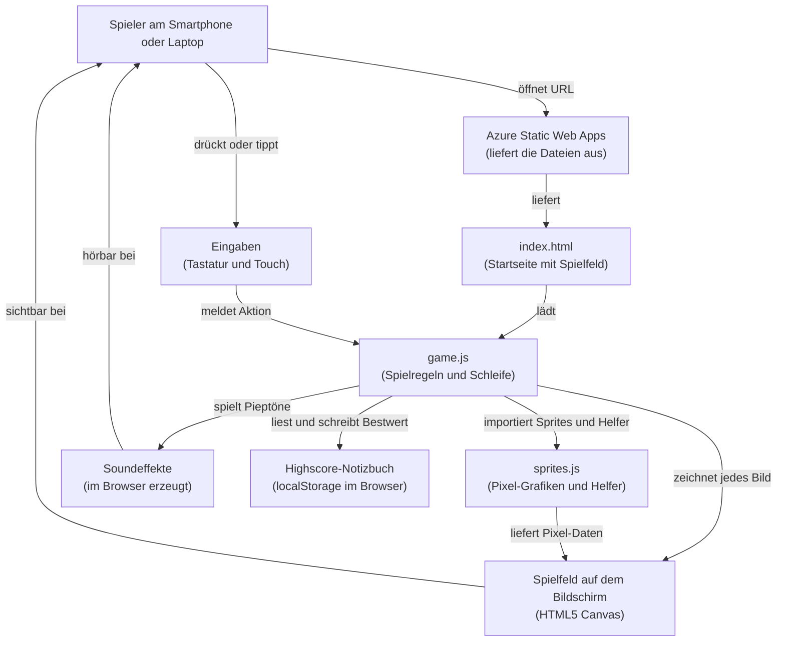

# Architektur: Space Invaders Demo

## 1. In einfachen Worten

Wir bauen das klassische Arcade-Spiel **Space Invaders** als kleine Web-Anwendung,
die jeder direkt im Browser seines Smartphones öffnen kann, ganz ohne Installation.
Das "Problem", das wir lösen, ist eigentlich keins im Ernstfall, sondern ein
Demo-Anliegen: Wir zeigen, wie schnell man eine interaktive App live vor Publikum
auf die Beine stellt und veröffentlicht. Der Nutzer steuert ein Raumschiff am
unteren Bildschirmrand, schießt auf herabkommende Aliens und versucht, einen
möglichst hohen Punktestand zu erreichen. Der persönliche Highscore bleibt auf
dem eigenen Gerät gespeichert, sodass jede Runde "die eigene Bestmarke schlagen"
heißt.

## 2. Die Bausteine

### Der Spielbildschirm (HTML5 Canvas)
Wie eine digitale Leinwand, auf die wir 60-mal pro Sekunde ein neues Bild malen,
um Bewegung zu erzeugen. Wir nutzen dafür das in jedem modernen Browser eingebaute
Zeichenfeld (**HTML5 Canvas**), weil es keine zusätzliche Bibliothek braucht und
extrem schnell ist.

### Die Spiellogik (Vanilla JavaScript)
Das ist das "Gehirn" des Spiels: Es weiß, wo die Aliens stehen, wann ein Schuss
trifft und wann das Spiel vorbei ist. Wir schreiben das in **purem JavaScript ohne
Framework** (also ohne fertigen Baukasten wie React), weil das Spiel klein ist,
ohne Ladezeiten startet und in der Demo gut nachvollziehbar bleibt.

### Die Pixel-Grafiken (sprites.js)
Wie ein Setzkasten mit fertigen Stempeln für Spielerschiff, Geschosse und drei
Alien-Typen (Tux, Windows-Logo, Creeper). Diese Datei (`sprites.js`) liefert die
**Sprite-Definitionen** als kleine Pixel-Raster plus Hilfsfunktionen
(`drawSprite`, `spriteWidth`, `spriteHeight`, `collides`) zum Zeichnen und für die
Treffererkennung. Sie ist die **einzige Quelle der Wahrheit** für alle Grafiken
und wird von der Spiellogik in jedem Frame aufgerufen.

### Die Steuerung (Tastatur + Touch)
Am Laptop benutzt man Pfeiltasten und Leertaste, am Smartphone tippt und wischt
man auf dem Bildschirm. Wir hören dafür auf die normalen Eingabe-Ereignisse des
Browsers (**KeyboardEvents** und **TouchEvents**), damit dasselbe Spiel auf beiden
Geräten funktioniert.

### Die Soundeffekte (Web Audio API)
Statt MP3-Dateien nachzuladen, **erzeugen wir die Schuss- und Treffer-Geräusche
direkt im Browser** als kurze Pieptöne. Dafür nutzen wir die im Browser eingebaute
Tonwerkstatt (**Web Audio API**) - das spart Ladezeit und macht die App komplett
selbstgenügsam.

### Der Highscore-Speicher (localStorage)
Wie ein kleines Notizbuch, das der Browser pro Gerät führt: Der höchste Punktestand
des Spielers wird **lokal im Browser** abgelegt (**localStorage**) und beim nächsten
Besuch wieder angezeigt. Bewusst kein Server, keine Anmeldung, keine Cloud, jeder
Zuschauer hat seinen eigenen Highscore auf seinem eigenen Handy.

### Das Hosting (Azure Static Web Apps)
Wie ein digitales Schaufenster im Internet, das die fertigen Dateien (HTML, JS)
weltweit ausliefert. **Azure Static Web Apps** ist dafür ideal, weil es kostenlos
startet, automatisch aus GitHub deployt und keine Server-Wartung braucht, perfekt
für eine reine Frontend-App wie unsere.

## 3. Wie alles zusammenspielt

## 4. Technische Details

| Bereich | Technologie | Zweck |
|---|---|---|
| Rendering | HTML5 Canvas 2D Context | Frame-basierte Pixel-Ausgabe (~60 FPS) |
| Sprache | Vanilla JavaScript (ES Modules) | Spiellogik, keine Build-Pipeline nötig |
| Sprites | `sprites.js` | `PLAYER_SPRITE`, `BULLET_SPRITE`, `ALIEN_BULLET_SPRITE`, `TUX_SPRITE`, `WINDOWS_SPRITE`, `CREEPER_SPRITE`, `BUNKER_SPRITE` plus `COLOR_PALETTE` |
| Sprite-Helfer | `sprites.js` | `drawSprite(ctx, sprite, x, y, scale, color)`, `spriteWidth(sprite)`, `spriteHeight(sprite)`, `collides(a, b)` |
| Eingabe | `KeyboardEvent` (Desktop), `TouchEvent` (Mobile) | Bewegung links/rechts, Schuss |
| Audio | Web Audio API (`OscillatorNode`, `GainNode`) | Schuss-, Treffer-, Game-Over-Sound, ohne Asset-Files |
| Persistenz | `window.localStorage` (Schlüssel z. B. `space-invaders-highscore`) | Persönlicher Highscore pro Browser/Gerät |
| Game Loop | `requestAnimationFrame` | Synchronisierte Render-Schleife |
| Kollisionen | AABB-Check via `collides()` aus `sprites.js` | Schuss vs. Alien, Alien-Schuss vs. Spieler/Bunker |
| Hosting | Azure Static Web Apps (Free Tier) | Globales CDN, GitHub-Deploy, HTTPS out-of-the-box |
| Build | Keiner | Reine statische Dateien: `index.html`, `game.js`, `sprites.js`, optional `style.css` |
| Browser-Support | Aktuelle Chromium/Firefox/Safari (inkl. Mobile) | ES Modules, Canvas, Web Audio, localStorage |
